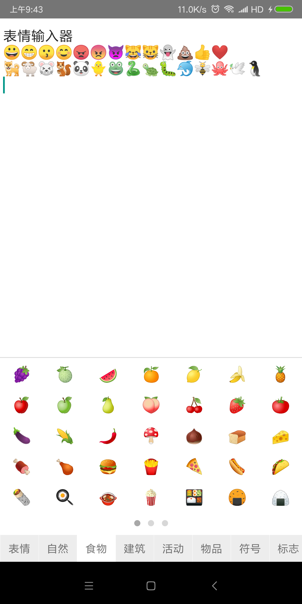

# react-native-emoji-view

> Emoji 表情输入器



## Usage

#### 1.Install
npm
```shell
$ npm install --save react-native-emoji-view
```
yarn
```shell
$ yarn add react-native-emoji-view
```

#### 2.Import
```javascript
import EmojiView from 'react-native-emoji-view';
```

#### 3.Render
```javascript
<EmojiView visible={true} onSelect={(emoji)=>alert(emoji)}/>
```

## Component Props
|Props|Type|Description|Default|
|-----|-----|-----|-----|
| visible | boolean | 是否显示 |  |
| onSelect | func | 点击表情时的回调 | null |